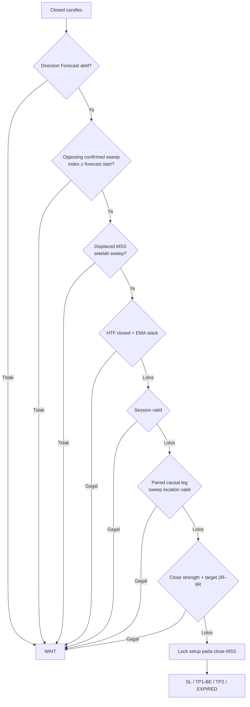

# Amy FX Causal Entry Watch V3 — Final Validation 2021–2022

Tanggal validasi: 2026-07-29

Branch: `personal/amyfx-private`

Baseline: `c5866a7a6f131099de86514c5ecb6c340ee39f44`

## Ringkasan hasil

Empat pekerjaan yang disetujui selesai tanpa mengubah rumus entry, SL, TP1, TP2, jumlah bar EXPIRED, urutan lifecycle, threshold, session window, candle source, UI, Supabase, Vercel, atau Mapping Snapshot.

Hasil akhirnya tetap **0 setup M5 dan 0 setup M15**. Ini bukan lagi karena Dealing Location:

- M5: Dealing Location lolos `2/2` kandidat yang sudah mencapai displaced MSS.
- M15: Dealing Location lolos `33/38` kandidat yang sudah mencapai displaced MSS.
- Secara kumulatif, M5 menyisakan 2 kandidat hingga EMA dan M15 menyisakan 17 kandidat hingga EMA. Keduanya menjadi 0 tepat pada gate `SESSION`.
- Kandidat terdekat M5 (`2` bar) dan M15 (`5` bar) lolos `10/11` requirement; satu-satunya kegagalan adalah `SESSION`.

Sesuai aturan, tidak ada threshold yang dilonggarkan dan pekerjaan berhenti pada blocker berikutnya. Tidak ada performance backtest baru: replay hanya mengaudit urutan dan gate. Karena tidak ada setup terkunci, future candle tidak dibaca untuk memberi outcome.

JSON pendamping: [`amyfx-causal-entry-watch-2021-2022-final-validation.json`](./amyfx-causal-entry-watch-2021-2022-final-validation.json).

## Akar masalah final

| Kategori | Akar masalah nyata | Status |
|---|---|---|
| Bug fungsi | Terminal setup dari `entryMap.setup` hilang ketika consumer hanya membaca `activeSetup`; scanner dan notifikasi akhirnya tidak mendapat status terminal utuh. | Diperbaiki dengan lifecycle contract bersama; status terminal tetap exact. |
| Bug fungsi | Sweep yang terjadi sebelum Direction Forecast masih dapat dipilih dari sweep memory, sehingga urutan tampak causal padahal `sweep.index < forecastStartIndex`. | Diperbaiki: sweep wajib `>= forecastStartIndex`, MSS wajib setelah sweep, semuanya closed-candle. |
| Bug fungsi/semantik | Slow high dan slow low terakhir dipasangkan tanpa jaminan berasal dari satu leg, lalu posisi gate memakai close breakout MSS sebagai satu-satunya referensi. | Diperbaiki dengan paired causal zigzag leg dan gate pada lokasi sweep; POI, entry, serta kekuatan close MSS tetap tercatat terpisah. |
| Bug replay yang juga menyentuh Mapping Engine | `Date.now()` berada di core `analyze`, jadi masalah bukan hanya harness. Replay Mapping Engine juga dapat menerima session saat ini bila waktu analisis tidak diinjeksi. | Diperbaiki: live tetap `Date.now()`, replay memakai timestamp candle closed terakhir atau timestamp explicit. Mapping Snapshot tidak diubah. |
| Diagnosis kurang jelas | Structural target mencampur kegagalan target dengan risk cap, sehingga enam kasus M5 terlihat sebagai target-pass padahal risk `>6 ATR`. | Diperjelas menjadi lima kode exact tanpa mengubah threshold. |
| Perilaku desain | Session window M5/M15 tetap London `14:00–18:00 WITA` atau New York `19:30–04:00 WITA`; kandidat 24 Oktober 2021 terjadi `07:30 WITA`. | Sengaja tidak diubah; sekarang menjadi blocker berikutnya. |
| Perilaku desain | Causal V3 masuk pada close MSS, sehingga `MISSED_ENTRY` tidak berlaku. | Tetap `N/A`. |

## Alur gate

## Perubahan per tahap dan file

### Tahap 1 — lifecycle terminal, replay time, target diagnosis

Commit: `8ab9ed640de9c3edad7f5e274698b2e9bc48b828`

File:

- `app/src/main/assets/apps/mapping/js/api/market-data.js`
- `app/src/main/assets/apps/mapping/js/engine/concept-analyze.js`
- `app/src/main/assets/apps/mapping/js/engine/concept-entry-map-v3.js`
- `app/src/main/assets/apps/mapping/js/engine/core/analyze.js`
- `tests/mapping-accuracy-v3.test.mjs`
- `tests/mapping-candle-stale-ttl.test.mjs`
- `tests/mapping-news-background-repair.test.mjs`
- `tests/mapping-session-replay.test.mjs`

Alasan:

- Meneruskan `SL HIT`, `TP1 HIT / BE`, `TP2 HIT`, `TP1 / BE`, dan `EXPIRED` dari authoritative `entryMap.setup` ke `setupExecution`, Entry Watch, scanner, dan notifikasi.
- Memisahkan live time dari replay time.
- Memberi diagnosis target `NO TARGET`, `TARGET < 2R`, `TARGET > 8R`, `RISK > 6 ATR`, atau `TARGET VALID 2R–8R`.

Tidak ada perubahan setup generation yang tidak diharapkan. Perubahan M5 target-pass `11 → 5` hanya koreksi klasifikasi: enam kasus itu tetap ditolak oleh risk cap `>6 ATR` sebelum maupun sesudah.

### Tahap 2 — forecast → sweep → MSS

Commit: `c409cbd26334a21d8089007ca3802b6f254e57f8`

File:

- `app/src/main/assets/apps/mapping/js/engine/concept-entry-map-v3.js`
- `tests/mapping-accuracy-v3.test.mjs`

Alasan:

- Sweep memory sekarang difilter dengan `sweep.index >= forecastStartIndex`.
- MSS tetap harus `mss.index > sweep.index`.
- Index sweep/MSS tidak boleh melewati latest closed index.

Kandidat yang dibuang karena memakai sweep sebelum forecast:

| TF | Active bar dengan pre-forecast sweep | Di antaranya juga menunjukkan MSS | Sequence unik | Sequence unik + MSS |
|---|---:|---:|---:|---:|
| M5 | 937 | 377 | 82 | 42 |
| M15 | 234 | 113 | 63 | 31 |

Future-leak violation: `0`.

### Tahap 3 — paired structural-leg Dealing Location

Commit: `073ff7076f6fce41071cb239912a1377f132c3e5`

File:

- `app/src/main/assets/apps/mapping/js/engine/concept-entry-map-v3.js`
- `tests/mapping-accuracy-v3.test.mjs`

Alasan:

- Slow pivots dijadikan causal zigzag; pivot sejenis berurutan dikompresi ke structural extreme.
- Range hanya memakai dua pivot berlawanan yang berurutan dalam satu leg dan sudah confirmed saat sweep.
- Gate memakai posisi sweep pada leg. POI, entry close, dan close-strength MSS menjadi diagnosis terpisah.
- Threshold tidak berubah: BUY `≤0.60`, SELL `≥0.40`.

Hasil:

| TF | MSS dievaluasi | PASS | FAIL | Tanpa paired leg | Leg |
|---|---:|---:|---:|---:|---|
| M5 | 2 | 2 | 0 | 0 | 2 UP |
| M15 | 38 | 33 | 5 | 0 | 34 DOWN, 4 UP |

### Tahap 4 — regression dan validasi akhir

Commit: commit yang memuat dokumen ini; SHA final dicatat pada handoff.

File:

- `docs/backtests/AMYFX_CAUSAL_ENTRY_WATCH_2021_2022_FINAL_VALIDATION.md`
- `docs/backtests/amyfx-causal-entry-watch-2021-2022-final-validation.json`
- `.agent-memory/DECISIONS.md`
- `.agent-memory/BUG_HISTORY.md`
- `.agent-memory/FEATURE_HISTORY.md`
- `.agent-memory/TODO_MEMORY.md`
- `.agent-memory/CHANGELOG_MEMORY.md`

Tidak ada perubahan engine pada Tahap 4.

## Sebelum dan sesudah

Angka berikut adalah jumlah active-forecast bar yang masing-masing lulus gate; ini bukan jumlah trade unik.

### M5

| Tahap | Forecast aktif | Sweep | MSS | HTF | EMA | Session | Dealing | Close | Target | Setup |
|---|---:|---:|---:|---:|---:|---:|---:|---:|---:|---:|
| Baseline | 2.634 | 1.465 | 379 | 245 | 364 | 247 | 0 | 307 | 11 | 0 |
| Tahap 1 | 2.634 | 1.465 | 379 | 245 | 364 | 247 | 0 | 307 | 5 | 0 |
| Tahap 2 | 2.634 | 528 | 2 | 2 | 2 | 0 | 0 | 2 | 2 | 0 |
| Tahap 3/final | 2.634 | 528 | 2 | 2 | 2 | 0 | 2 | 2 | 2 | 0 |

### M15

| Tahap | Forecast aktif | Sweep | MSS | HTF | EMA | Session | Dealing | Close | Target | Setup |
|---|---:|---:|---:|---:|---:|---:|---:|---:|---:|---:|
| Baseline | 2.845 | 526 | 151 | 151 | 19 | 51 | 23 | 135 | 5 | 0 |
| Tahap 1 | 2.845 | 526 | 151 | 151 | 19 | 51 | 23 | 135 | 5 | 0 |
| Tahap 2 | 2.845 | 292 | 38 | 38 | 17 | 12 | 0 | 27 | 5 | 0 |
| Tahap 3/final | 2.845 | 292 | 38 | 38 | 17 | 12 | 33 | 27 | 5 | 0 |

## Funnel kumulatif final

Funnel ini mengikuti urutan gate. Berbeda dari tabel individual di atas, sebuah kandidat hanya dihitung bila semua gate sebelumnya juga lulus.

| Gate | M5 | M15 |
|---|---:|---:|
| DATA | 2.634 | 2.845 |
| DIRECTION | 2.634 | 2.845 |
| OPPOSING LIQUIDITY SWEEP | 528 | 292 |
| DISPLACED MSS | 2 | 38 |
| HTF ALIGNMENT | 2 | 38 |
| EMA STACK | 2 | 17 |
| EMA DISTANCE | 2 | 17 |
| SESSION | **0** | **0** |
| DEALING LOCATION | 0 | 0 |
| CLOSE LOCATION | 0 | 0 |
| STRUCTURAL TARGET ≥2R | 0 | 0 |
| SETUP | **0** | **0** |

Forecast event unik: M5 `61`, M15 `85`. Active-forecast bar: M5 `2.634`, M15 `2.845`.

Diagnosis target pada displaced MSS final:

| Diagnosis | M5 | M15 |
|---|---:|---:|
| NO TARGET | 0 | 0 |
| TARGET <2R | 0 | 33 |
| TARGET >8R | 0 | 0 |
| RISK >6 ATR | 0 | 0 |
| TARGET VALID 2R–8R | 2 | 5 |

## Perbandingan rolling 300 vs 800

Semua hasil keputusan sama:

- gate counts sama persis;
- kasus terpilih sama;
- waktu/harga anchor sama;
- setup tetap `0/0`;
- future-leak violation tetap `0`.

Perbedaan hanya:

- local array index bergeser 500 karena origin window berbeda;
- EMA seed menghasilkan drift numerik kecil, maksimum `0,01681` pada harga XAU.

Drift tersebut tidak mengubah EMA ordering, gate, anchor, sequence, atau setup. Karena tidak ada perbedaan besar, hasil live-parity 300 tidak dipilih untuk menutupi hasil 800.

## Validasi window prioritas

Pemilihan kandidat bersifat deterministik: requirement-pass terbanyak, lalu presence MSS, lalu presence sweep, lalu candle paling awal. Ini hanya untuk diagnosis dan tidak dipakai untuk tuning.

### Ringkasan

| Kasus | Forecast start | Sweep causal | MSS | Gate maksimum | Blocker pertama | Outcome |
|---|---|---|---|---:|---|---|
| M5 19 Mar 2021 11:55–13:30 | 11:50, index 15034 | Tidak ada; SSL 11:40 dan 10:10 mendahului forecast | N/A | 2/11 | Opposing sweep | N/A |
| M15 9 Apr 2021 07:00–07:15 | 07:00, index 6272 | Tidak ada; SSL 06:00 mendahului forecast | N/A | 2/11 | Opposing sweep | N/A |
| M15 24–25 Oct 23:30–00:30 | 20:30, index 19094 | SSL 21:30, index 19098 | 23:30, index 19106 | 10/11 | Session | N/A |
| M15 28 Apr 2022 | 08:00, index 31132 | BSL 08:30, index 31134 | N/A | 3/11 | Displaced MSS | N/A |
| M15 7 Jun 2022 | 08:15, index 33699 | BSL 09:45, index 33705 | N/A | 3/11 | Displaced MSS | N/A |
| M15 3 Oct 2022 | 07:45, index 41395 | Tidak ada; tiga SSL 05:15–05:30 mendahului forecast | N/A | 2/11 | Opposing sweep | N/A |

Semua waktu pada tabel adalah UTC.

### Detail 19 Maret 2021 M5

- Candle terpilih: `11:55 UTC`; forecast BULLISH mulai `11:50`, index `15034`.
- Rejected sweep: SSL index `15032` pada `11:40`, level `1738,61`; SSL index `15014` pada `10:10`, level `1734,35`. Keduanya mendahului forecast.
- Last closed H4: `08:00–12:00`, O/H/L/C `1739,06 / 1742,28 / 1733,16 / 1742,24`.
- EMA21/34/90 informational pada observed close: `1739,16635 / 1738,53206 / 1738,01557`; ATR `1,26786`.
- Mapping session dari timestamp: `LONDON`; entry clock `19:55 WITA` masuk New York window. Session gate belum dievaluasi karena belum ada MSS.
- Anchor, raw position, protected swing, entry, SL, TP1, TP2, obstacle, RR: `N/A` karena tidak ada sweep causal dan MSS.
- Terminal outcome: `N/A — NO SETUP LOCKED`.

### Detail 9 April 2021 M15

- Candle/forecast terpilih: `07:00 UTC`, index `6272`, BULLISH.
- Rejected sweep: SSL index `6268`, `06:00`, level `1743,91`; mendahului forecast.
- Last closed H4: `00:00–04:00`, O/H/L/C `1753,07 / 1753,49 / 1743,95 / 1747,39`.
- EMA21/34/90 informational: `1747,00138 / 1748,19133 / 1749,30946`; ATR `1,85429`.
- Session: `LONDON`, `15:00 WITA`; session gate belum dievaluasi tanpa MSS.
- Dealing range, protected swing, entry, SL/TP, obstacle/RR, outcome: `N/A`.

### Detail 24–25 Oktober 2021 M15

- Forecast BULLISH: index `19094`, `20:30 UTC`.
- Opposing SSL sweep: index `19098`, `21:30`, level `1792,33`.
- Displaced MAJOR MSS: index `19106`, `23:30`, level `1797,81`.
- Last closed H4 saat MSS: `16:00–20:00`, O/H/L/C `1792,47 / 1794,36 / 1792,17 / 1794,31`; confirmed closed sebelum MSS.
- EMA21/34/90: `1794,99127 / 1794,80731 / 1793,36533`, PASS.
- Session dari timestamp MSS: Mapping `OFF_SESSION`; `07:30 WITA`, FAIL.
- Paired range: `DOWN_LEG`; high `1813,75` pada `2021-10-22 11:00`; low `1782,79` pada `11:30`.
- Sweep raw/clamped position: `0,3081395 / 0,3081395`, PASS BUY `≤0,60`; sweep extreme `1792,28` di posisi `0,3065245`.
- POI FVG: `1793,97–1794,90`; midpoint `1794,435`; raw position `0,3761305`.
- MSS/entry location: close `1798,46`; raw/clamped `0,506137 / 0,506137`; close-strength PASS.
- Protected swing `1792,16`; ATR `1,932857`.
- Geometri provisional, **bukan setup**: entry `1798,46`; SL `1791,193571`; TP1 `1805,726429`; TP2 `1813,75`.
- First obstacle BSL swing `1813,75`; risk `7,266429` atau `3,759424 ATR`; RR `2,104197`; diagnosis `TARGET VALID 2R–8R`.
- Terminal outcome `N/A — NO SETUP LOCKED`; future candle tidak dibaca.

### Detail 28 April 2022 M15

- Forecast BEARISH: index `31132`, `08:00 UTC`.
- Eligible BSL sweep: index `31134`, `08:30`, level `1891,66`; displaced MSS belum muncul.
- Rejected pre-forecast BSL: index `31123`, `05:45`, level `1891,44`.
- Last closed H4: `04:00–08:00`, O/H/L/C `1884,89 / 1891,66 / 1879,86 / 1886,10`.
- EMA21/34/90 informational: `1886,48175 / 1885,53766 / 1886,61791`; ATR `3,59286`.
- Session: `LONDON`, `16:30 WITA`.
- Causal leg tersedia saat sweep: `UP_LEG`, low `1871,94` pada `01:30`, high `1891,66` pada `05:45`; raw/clamped sweep position `1/1`.
- Gate Dealing belum dievaluasi karena MSS belum ada. Protected swing, entry, SL/TP, obstacle/RR, outcome: `N/A`.

### Detail 7 Juni 2022 M15

- Forecast BEARISH: index `33699`, `08:15 UTC`.
- Eligible BSL sweep: index `33705`, `09:45`, level `1851,84`; displaced MSS belum muncul.
- Rejected pre-forecast BSL: index `33696`, `07:30`, level `1848,81`.
- Last closed H4: `04:00–08:00`, O/H/L/C `1842,03 / 1851,84 / 1842,01 / 1847,28`.
- EMA21/34/90 informational: `1846,56432 / 1845,82584 / 1845,51496`; ATR `2,81929`.
- Session: `LONDON`, `17:45 WITA`.
- Causal leg tersedia saat sweep: `UP_LEG`, low `1838,40` pada `02:00`, high `1851,84` pada `06:45`; raw/clamped sweep position `1/1`.
- Gate Dealing belum dievaluasi karena MSS belum ada. Protected swing, entry, SL/TP, obstacle/RR, outcome: `N/A`.

### Detail 3 Oktober 2022 M15

- Candle/forecast terpilih: `07:45 UTC`, index `41395`, BULLISH.
- Tiga SSL ditolak karena mendahului forecast: index `41385` `05:15` level `1661,04`; index `41386` `05:30` level `1659,97`; PDL index `41386` level `1660,12`.
- Last closed H4: `04:00–08:00`, O/H/L/C `1663,66 / 1666,80 / 1659,60 / 1666,12`.
- EMA21/34/90 informational: `1664,04803 / 1664,00759 / 1664,04058`; ATR `2,18143`.
- Session: `LONDON`, `15:45 WITA`; session gate belum dievaluasi tanpa MSS.
- Anchor, raw position, protected swing, entry, SL/TP, obstacle/RR, outcome: `N/A`.

## Lifecycle

Historical setup terkunci: `0`.

| Outcome | Jumlah |
|---|---:|
| SL HIT | 0 |
| TP1 HIT / BE | 0 |
| TP2 HIT | 0 |
| TP1 / BE | 0 |
| EXPIRED | 0 |
| MISSED_ENTRY | N/A |

Lifecycle contract telah diuji secara synthetic untuk memastikan status terminal diteruskan tanpa mengubah formula atau urutan. Angka di atas tidak mengklaim lifecycle historis sudah teruji nyata; itu tetap belum mungkin sampai ada setup yang lulus seluruh gate.

## Risiko regresi terhadap Mapping Engine

- **Session context:** shared core berubah, tetapi live tanpa replay option tetap memakai waktu sekarang. Risiko berada pada caller replay yang salah memberi mode/timestamp; test explicit seconds, milliseconds, closed candle, dan open future candle menutup jalur utama.
- **Causal ordering:** kandidat lama turun besar karena false causal sequences dibuang. Ini perubahan yang diinginkan, bukan optimasi performa.
- **Dealing Location:** shared V3 engine live kini menilai sweep pada paired leg. Risiko utama adalah pivot availability dan stabilitas window; 300/800 menghasilkan keputusan identik dan test menutup same-kind compression, confirmation lag, serta BUY/SELL threshold.
- **Terminal propagation:** terminal setup sekarang terlihat oleh scanner/notifikasi. Risiko duplicate alert ditahan oleh lifecycle/notification state yang sudah ada; tidak ada perubahan interval atau signer.
- Mapping Snapshot, candle API, cache, updater, Supabase, Vercel, UI layout, dan `main` tidak disentuh.

## Validasi test

- Tahap 1 targeted: `24/24` PASS; full suite: `86/86` test files PASS.
- Tahap 2 targeted: `37/37` PASS; full suite: `86/86` test files PASS.
- Tahap 3 targeted: `40/40` PASS; full suite: `86/86` test files PASS.
- Tahap 4 full regression: `86/86` Amy FX regression files PASS.

## Kesimpulan

Lifecycle propagation, replay time, target diagnosis, causal ordering, dan Dealing Location sudah diperbaiki sesuai batas yang disetujui. Setup final tetap nol. Blocker berikutnya adalah session gate yang memang dirancang demikian, bukan Dealing Location. Tidak ada dasar untuk melonggarkan session, threshold, displacement, sweep memory, atau gate lain dari hasil ini.
